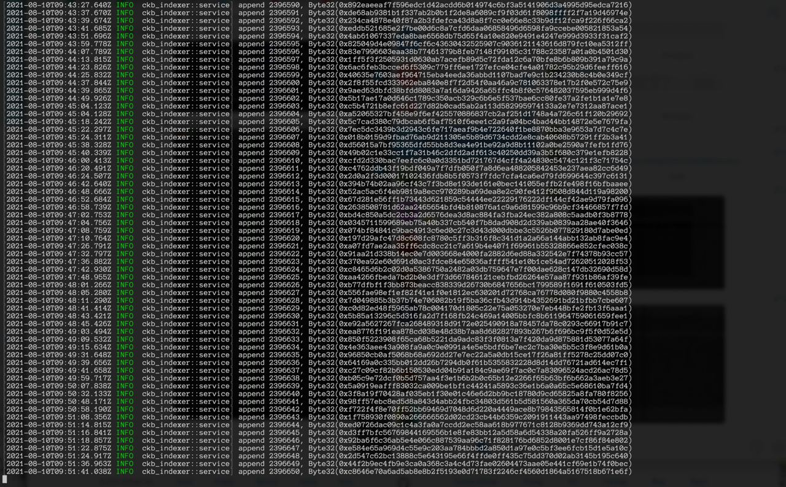

# [Task 0: Setup a Local CKB Node and CKB Indexer for the Testnet](https://gitcoin.co/issue/nervosnetwork/grants/1/100026176)
https://gitcoin.co/issue/nervosnetwork/grants/1/100026176
1) A screenshot of the console output from your local Testnet CKB Node after it has fully synchronized with the network.

3) A screenshot of the console output from your local CKB Indexer after it has fully synchronized with the local Testnet CKB Node.

